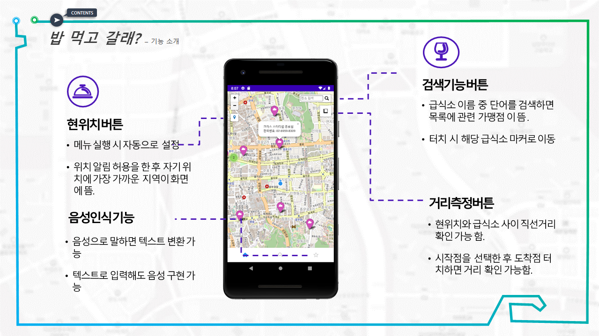

# 밥먹고갈래? - 공공데이터를 활용한 무료 급식소 위치 서비스
팀명 : 한끼뚝딱 
팀장 : 권희정
팀원 : 박연아, 이수빈 

##### 자세한 설명: 서비스개발_한끼뚝딱.pdf 참고

## 주제 
#### 급식 지원이라는 공통사업을 한눈에 알아볼 수 있는 무료급식소 및 아동 급식 지원  가맹점 위치 서비스 안드로이드 앱 제작

## 데이터 -공공데이터 
#### 전국무료급식소 표준데이터
#### 전국 아동복지 급식 정보 표준데이터
#### (착한소비) 선한 영향력 가게 데이터 

## 개발 언어 및 알고리즘  
#### 언어 : Python(데이터시각화), javascript(안드로이드 제작)
#### Python - folium library(leaflet.js기반의 지도 라이브러리)  

## 데이터 전처리 
#### 운영 급식소 데이터 추출 - 운영종료일자 21년 11월 30일 이후 시설 + 종료일자가 없는 시설
#### 위경도 결측치 제거, 급식요일 값 통일, 운영시간 파생변수 생성 등 

## 메뉴소개
#### 메뉴를 터치 시 각 메뉴에 해당하는 데이터가 포함된 지도가 나타남. 
#### 노인 무료 급식소 
#### 아동급식카드 가맹점 
#### 선한 영향력 가게 

## 기능 소개

## '밥 먹고 갈래?' 차별성
#### 1. 모든 대상이 사용가능함. (무료급식노인, 급식지원 아동, 가치있는 소비를 실천하는 사람들)
#### 2. 음성인식 기능을 추가해 날마다 급식소나 식단을 기록하면 사용자의 건강상태를 확인가능함. 

## 추후 개발 계획
#### 1. 음성인식기능은 작동하지만 데이터 저장이 어려워 추후 개발 예정
#### 2. 지도 안에 있는 급식 운영 정보를 음성으로 말하는 기능을 추가할 예정
#### 3. 사용자 입장에서 앱화면 디자인 보완할 예정임. 

